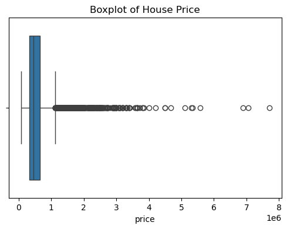

# 🏠 House Price Prediction – King County

## 📌 Project Overview

This project focuses on predicting house prices in King County, USA using multiple regression-based machine learning models.

The objective was to:

- Handle skewed target distribution
- Compare linear vs ensemble models
- Perform hyperparameter tuning
- Evaluate models on both log-transformed and real price scales
- Select the best-performing model based on generalization performance

---

## 📊 Dataset

**Dataset:** House Sales in King County, USA  
**Source:** Kaggle – House Sales in King County, USA  
🔗 https://www.kaggle.com/datasets/harlfoxem/housesalesprediction  

- 21 Features  
- 21,614 rows  
- Target variable: `price`

---

## 🧹 Data Preprocessing

- Checked for missing values  
- Log transformation applied to target variable:


```python
df["price"] = np.log1p(df["price"])

```
## 🤖 Models Implemented

The following regression models were trained and evaluated:

- Linear Regression

- Ridge Regression

- Random Forest Regressor

- Gradient Boosting Regressor (Tuned)

## Model Performance Comparison

Gradient Boosting achieved the best overall performance across both log and real price scales.

### Log Scale Performance:

| Model             | Train R² | Test R²    |
| ----------------- | -------- | ---------- |
| Linear Regression | 0.8757   | 0.8743     |
| Ridge Regression  | 0.8757   | 0.8743     |
| Random Forest     | 0.9539   | 0.8841     |
| Gradient Boosting | 0.9256   | **0.9009** |

<br>

### Real Price Scale Performance:

| Model                 | R²         | MAE ($)    | RMSE ($)    |
| --------------------- | ---------- | ---------- | ----------- |
| Linear Regression     | 0.6498     | 82,164     | 230,104     |
| Ridge Regression      | 0.6499     | 82,163     | 230,069     |
| Random Forest         | 0.8230     | 77,398     | 163,597     |
| **Gradient Boosting** | **0.8848** | **69,137** | **131,991** |


## 📈 Target Distribution Before & After Log Transformation




## 🔄 Cross-Validation

To ensure model robustness and avoid overfitting, 5-Fold Cross Validation was applied:

- Ridge Regression: automatic alpha selection via RidgeCV (cv=5)
- Random Forest: RandomizedSearchCV with 5-fold CV
- Gradient Boosting: evaluated on hold-out test set after tuning

Cross-validation helped ensure stable generalization performance across folds.


## 🏆 Final Model

The tuned Gradient Boosting Regressor achieved the best generalization performance:

- Highest R² on test data

- Lowest MAE

- Lowest RMSE

- Balanced bias-variance tradeoff

It was selected as the final model.

## 📊 Key Insights

- Log transformation significantly improved model stability.

- Linear models performed well but lacked nonlinear modeling power.

- Random Forest showed slight overfitting.

- Gradient Boosting provided the best overall predictive performance.

## 🛠 Technologies Used

- Python

- Pandas

- NumPy

- Scikit-learn

- Matplotlib / Seaborn

- Jupyter Notebook

## 🚀 How to Run the Project

```bash
git clone <your-repo-link>
cd <your-project-folder>
pip install -r requirements.txt
jupyter notebook
```

## 📂 Repository Structure


```text
├── data
│   ├── processed
│   │   ├── scaler.pkl
│   │   ├── x_train.pkl
│   │   ├── x_test.pkl
│   │   ├── x_train_scaled.pkl
│   │   ├── x_test_scaled.pkl
│   │   ├── y_train.pkl
│   │   └── y_test.pkl
│   └── raw
│       └── kc_house_data.csv
│
├── images
│   ├── boxplot-before-log.png
│   └── boxplot-after-log.png
│
├── notebooks
│   ├── 01_eda.ipynb
│   └── 02_modeling.ipynb
│
├── .gitignore
├── README.md
└── requirements.txt
```

## 👨‍💻 Author

Hossein Mohebbi

GitHub: https://github.com/HosseinMohebbi